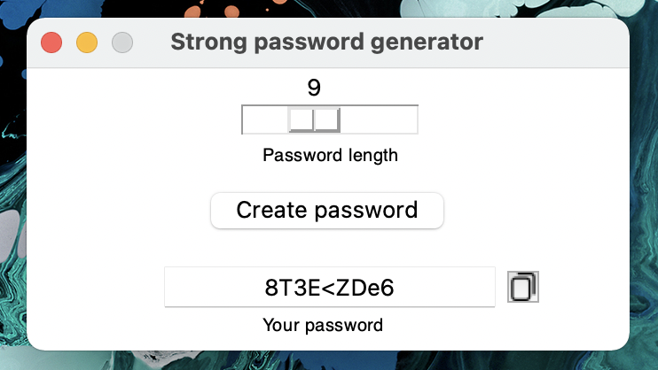

# Strong password generator with GUI build with Python and built-in tkinter module

## Table of Contents
* [General Info](#general-information)
* [Technologies Used](#technologies-used)
* [Features](#features)
* [Screenshots](#screenshots)
* [Setup](#setup)
* [Usage](#usage)
* [Project Status](#project-status)
* [Acknowledgements](#acknowledgements)
* [Contact](#contact)
<!-- * [License](#license) -->

## General Information
- This project was created to be a useful, lightweight tool - creator of strong passwords with an option to set its length.

## Technologies Used
- Python 3.7
- Python built-in 'tkinter' module

## Features
- Chossing length of password
- Creating strong passwords with numbers, letters and special symbols

## Screenshots

<!-- If you have screenshots you'd like to share, include them here. -->

## Setup
To run this, you need only Python 3.x

## Usage
To generate strong password, you have to choose the length, then click 'Create password' button and that's all! Then you can copy your password to clipboard by clicking on copy image button next to generated password.

## Project Status
Project is complete, I will update it if there will be some bugs or I will find some new features to add.

## Acknowledgements
- This project's strong password creation function was based on geeksforgeeks.org article

## Contact
Feel free to contact me via my mail michvlbbb@gmail.com

<!-- Optional -->
<!-- ## License -->
<!-- This project is open source and available under the [... License](). -->

<!-- You don't have to include all sections - just the one's relevant to your project -->
